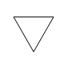

# Elementaire opdrachten en opeenvolging

Als voorbeeld van een programmeerbaar systeem gebruiken we een robot-schildpad ("turtle"). We kunnen deze turtle over een veld laten bewegen. Daarbij kan de turtle een spoor achterlaten: het resultaat, in de vorm van een tekening. Dit zou een fysieke robot kunnen zijn. In de bijgaande tutorial gebruiken we een simulatie van een turtle, op het scherm.

> Dit turtle-voorbeeld is klassiek: zoek op het web naar Turtle-graphics, Logo, Seymour Papert.

De turtle kunnen we de volgende elementaire opdrachten geven:

* `penUp()` - zet de pen op het papier (scherm), laat een spoor achter;
* `penDown()` - zet de pen omhoog (laat geen spoor meer achter);
* `forward(n)` - ga `n` stappen vooruit (bijvoorbeeld uitgedrukt in pixels);
* `right(n)` - draai `n` graden naar rechts.

Voor het draaien van de turtle moet je weten dat 90 graden een rechte hoek is; na een draai van 360 graden staat de turtle weer precies in dezelfde richting.

De betekenis van de haakjes zullen we later uitleggen.

Als je een opdracht wilt laten uitvoeren door de turtle, moet je voor de letters die tussen de haakjes staan, een getal invullen.

> Dit zijn *parameters* voor deze opdrachten; in de volgende les komen we daar op terug.

## Uitvoeren van opdrachten

De lijst van elementaire opdrachten hierboven vormt de taal waarin we de turtle kunnen besturen. Maar hoe kunnen we de turtle deze opdrachten laten uitvoeren?

* in het programma zijn deze opdrachten gekoppeld aan knoppen (buttons); een klik op zo'n knop voert de bijbehorende opdracht uit. We hebben dan als het ware een afstandsbesturing van de turtle.
* we kunnen deze opdrachten invoeren via het console, bijvoorbeeld: `forward(30);` of `penDown();`
* we kunnen deze opdrachten opnemen als onderdeel van een functie (een stukje script met een naam). Hiervan zullen we later voorbeelden zien. We kunnen de besturing van de turtle dan automatiseren.

Functies komen in een volgend hoofdstuk aan bod; we behandelen hier eerst de eerste twee manieren.

## Toestand van de turtle

Het resultaat van de uitvoering van een opdracht is de beweging van de turtle, samen met het spoor dat de turtle op het scherm achterlaat. Door een opdracht verandert de *toestand* van de turtle. Deze toestand bestaat uit de volgende onderdelen:

* `pos.x`: de positie in de x-richting (horizontaal, van links naar rechts; linkerzijde is 0);
* `pos.y`: de positie in de y-richting (verticaal, van boven naar beneden; bovenzijde is 0);
* `dir`: de richting van de turtle:
* `down`: de positie van de pen: `true` betekent dat de pen op het papier (scherm) staat, de turtle laat dan een spoor achter; `false` betekent dat de turtle geen spoor achterlaat.

De huidige toestand van de turtle zie je steeds weergegeven in een apart deel van het venster.

### *Het assenstelsel van de turtle

Het coördinatenstelsel (assenstelsel) van de turtle is misschien anders dan je gewend bent, bijvoorbeeld van Wiskunde. Een assenstelsel met de oorsprong "(0,0)" links boven is gebruikelijk voor computerschermen; je hoeft dan voor het scherm nooit met negatieve coordinaten te werken.

Ook de hoeken werken in dit stelsel anders: een positieve hoek draait met de klok mee. In een wiskundig assenstelsel is het gebruikelijk dat positieve hoeken tegen de klok in draaien.

Als je alleen met de opdrachten van de turtle werkt, heb je met dit coördinatenstelsel niet zoveel te maken: alle bewegingen van de turtle zijn relatief ten opzichte van de huidige positie van de turtle. Zo lang je in je programma de waarden `pos.x`, `pos.y`, `dir` niet gebruikt, is je programma onafhankelijk van het gebruikte coördinatenstelsel.

> Ga dit na.

## Syntax: JavaScript

We beschrijven deze opdrachten in de taal JavaScript. De spelregels van een programmeertaal zijn erg strikt: als je je daar niet aan houdt, werkt je programma niet, of doet het iets anders dan je bedoelt. Deze strikte regels zijn in eerste instantie bedoeld om aan de computer precies te instrueren. (Maar zie ook: "Leesbare programma's".)

## Opeenvolging: vierkant

Met de afzonderlijke opdrachten kunnen we nog niet zoveeel: de kracht zit in het combineren van opdrachten. De eenvoudigste manier is de *opeenvolging*: dit geven we aan door de opdrachten achter elkaar te zetten, waarbij we elke opdracht afsluiten door een `;`. Op deze manier kunnen we een vierkant tekenen:

```js
penDown();
forward(100); right(90);
forward(100); right(90);
forward(100); right(90);
forward(100); right(90);
```
Dit geeft het volgende resultaat:

> FIG vierkant

## Opeenvolging: driehoek

We kunnen op eenzelfde manier een driehoek tekenen:

```js
penDown();
forward(100); right(120);
forward(100); right(120);
forward(100); right(120);
```

Dit heeft als resultaat:

> 

